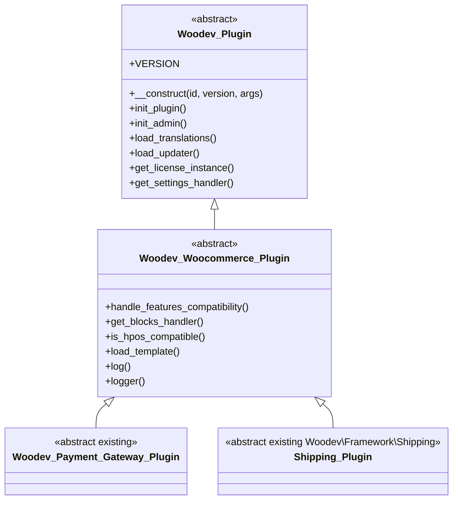

# Platform v2 Epic 1 Spec: Platform Layer
> Status: accepted (operator approved 2026-05-28)
> Date: 2026-05-28
> Scope: Epic 1 platform layer only

## 1. Goal & Non-Goals

Goal:

Split the framework platform layer so `Woodev_Plugin` becomes a pure WordPress base class, WooCommerce behavior moves behind `Woodev_Woocommerce_Plugin`, bootstrap remains platform-aware per [ADR-001](adr/001-bootstrap-platform-aware-loader.md), and plugin type is represented by inheritance with a deprecated metadata bridge per [ADR-002](adr/002-plugin-type-inheritance-with-metadata-bridge.md).

This implements the platform direction from [PLANS.md section 2](../PLANS.md) and the Framework Decoupling backlog item in [FUTURE-BACKLOG.md](FUTURE-BACKLOG.md#6-framework-decoupling--support-non-woocommerce-plugins), using the component ownership from the [Platform v2 Dependency Matrix](platform-v2-dependency-matrix.md).

Non-goals for Epic 1:

- Do not create `Woodev_EDD_Plugin` beyond reserving the future platform concept in metadata and documentation.
- Do not redesign payment-gateway internals, extract traits, or change gateway processing behavior.
- Do not implement shipping UI, shipping boilerplate, rate pipelines, labels, tracking, or carrier abstractions.
- Do not implement licensing webhooks or server-to-client push actions.
- Do not redesign or extract the box-packer algorithm.
- Do not introduce React admin screens or frontend build tooling.
- Do not perform full module migrations beyond the explicit spike scope and the ordered Epic 1 phases below.

Execution-order constraint:

The spec can be written now, but spike code must wait until v2.0.0 cleanup items #1 and #2 are complete: minimum WP/WC version cleanup, then unused US-specific payment type cleanup. This follows [FUTURE-BACKLOG.md](FUTURE-BACKLOG.md#maintenance--cleanup-v200), [FUTURE-BACKLOG.md](FUTURE-BACKLOG.md#6-framework-decoupling--support-non-woocommerce-plugins), and `CURRENT-STATE.md` v2.0.0 order.

## 2. Target Class Diagram



Target relationship notes:

- `Woodev_Plugin` is the base for pure WordPress plugins and platform-neutral framework services.
- `Woodev_Woocommerce_Plugin` owns WooCommerce runtime assumptions and dependencies.
- Existing `Woodev_Payment_Gateway_Plugin` currently extends `Woodev_Plugin`; in the target hierarchy it extends `Woodev_Woocommerce_Plugin`.
- Existing namespaced `Woodev\Framework\Shipping\Shipping_Plugin` currently extends `\Woodev_Plugin`; in the target hierarchy it extends `\Woodev_Woocommerce_Plugin`.
- Future `Woodev_EDD_Plugin` remains out of scope for Epic 1 implementation.

## 3. Bootstrap Refactor Plan

### What Stays In `bootstrap.php`

Per [ADR-001](adr/001-bootstrap-platform-aware-loader.md), `bootstrap.php` remains the platform-aware multi-version loader in v2.0.0.

Responsibilities that stay in `bootstrap.php`:

- Register frameworked plugins before `plugins_loaded`.
- Sort registered plugins by framework version using the current highest-version-first behavior.
- Load the selected framework copy from the highest compatible vendored framework path.
- Preserve active/incompatible plugin tracking for framework, WordPress, and WooCommerce requirements.
- Render admin notices for incompatible framework, WordPress, or WooCommerce versions.
- Coordinate early module loading that must happen before plugin callbacks instantiate child classes.
- Trigger `woodev_plugins_loaded` after registered plugin callbacks run.

Responsibilities that must not expand in `bootstrap.php`:

- Runtime platform behavior after plugin instantiation.
- WooCommerce feature declarations, HPOS, Blocks, templates, loggers, REST status behavior, or settings wrappers.
- Payment-gateway internals, shipping behavior, licensing logic, or module implementation details.

### Platform Detection Flow

The loader should normalize each plugin registration into a metadata shape before compatibility checks and module loading.

Target detection order:

1. Start with explicit v2 metadata when present: `platform`, `type`, and `modules`.
2. Map legacy args into compatibility metadata: `minimum_wc_version`, `is_payment_gateway`, and `load_shipping_method`.
3. Infer `platform = woocommerce` when WooCommerce-specific legacy args are present.
4. Default to `platform = wordpress` when no platform metadata and no WooCommerce-specific legacy args are present.
5. Check `minimum_wp_version` for all plugins.
6. Check `minimum_wc_version` and WooCommerce active/version only for plugins whose normalized platform is `woocommerce`.
7. Load only the module set required by the normalized platform/type metadata before invoking the plugin callback.

Initial normalized metadata shape:

```php
[
    'platform' => 'wordpress' | 'woocommerce',
    'type'     => 'plugin' | 'payment_gateway' | 'shipping',
    'modules'  => string[],
]
```

Notes:

- `edd` may be accepted only as a reserved value in documentation/tests if useful, but no `Woodev_EDD_Plugin` code is part of Epic 1.
- Inheritance is the target source of truth per [ADR-002](adr/002-plugin-type-inheritance-with-metadata-bridge.md), but metadata remains necessary during the bridge because the loader must require some base classes before child classes can be declared.

### Multi-Version Resolution Invariants

Unchanged behavior to preserve:

- Multiple production plugins may bundle different framework versions and register from their own vendored copy.
- The highest compatible framework version wins and provides the loaded `Woodev_Plugin::VERSION` source.
- Older registered plugins remain active when they are within the loaded framework's declared backward-compatibility window.
- Plugins outside the backward-compatibility window are skipped and reported through existing update/deactivation notices.
- A plugin skipped for incompatible WP/WC requirements must not have its callback invoked.
- `register_plugin()` must still be called before `plugins_loaded`; this timing remains a documented bootstrap gotcha.
- `Woodev_Plugin_Bootstrap::instance()` remains the singleton entry point.

New invariants for Epic 1:

- Pure WordPress plugins must not be skipped solely because WooCommerce is inactive.
- WooCommerce plugins must not initialize when WooCommerce is missing or below their declared minimum.
- WooCommerce-only modules must not be required for pure WordPress plugins.
- The selected framework copy must be used consistently for base class, platform subclass, and module class loading.
- Legacy metadata must preserve current payment/shipping class availability during the bridge period.

### Module Loading Rules

Base-level modules available to `Woodev_Plugin` during Epic 1:

- Core exception and framework support classes that do not require WooCommerce at runtime.
- Platform-neutral portions of helpers, lifecycle, dependencies, hook deprecator, admin notices/messages.
- `api/` after residual WooCommerce helper usage is isolated.
- `settings-api/` after residual WooCommerce helper usage is replaced or guarded.
- `licensing/` core activation/update-check behavior after residual WooCommerce helpers are replaced or guarded.
- `plugin-updater/`.
- `handlers/script-handler.php`.
- Generic utilities after WooCommerce debug/session hooks are guarded or moved.
- REST base infrastructure after WooCommerce status/settings route behavior is split.

WooCommerce-only modules owned by `Woodev_Woocommerce_Plugin` or specialized subclasses:

- `compatibility/class-plugin-compatibility.php` and `compatibility/class-order-compatibility.php`.
- `handlers/blocks-handler.php`.
- WooCommerce feature compatibility declarations for HPOS and Cart/Checkout Blocks.
- WooCommerce logger/template helpers.
- WooCommerce settings wrappers and WC system-status integration.
- `payment-gateway/`.
- `shipping-method/`.
- `box-packer/` for v2, until a later post-v2 extraction or wrapper is designed.

Spike rule:

The P0 spike should prove module isolation with the smallest slice. It should not migrate every P1 module at once.

### `register_plugin()` Args

Current args to preserve:

- `backwards_compatible`
- `minimum_wp_version`
- `minimum_wc_version`
- `is_payment_gateway`
- `load_shipping_method`

V2 generalized metadata:

```php
[
    'minimum_wp_version' => '6.3',
    'minimum_wc_version' => '7.0',
    'platform'           => 'wordpress' | 'woocommerce',
    'type'               => 'plugin' | 'payment_gateway' | 'shipping',
    'modules'            => [],
]
```

Bridge mapping:

| Legacy arg | V2 metadata equivalent | Bridge behavior |
|------------|------------------------|-----------------|
| `minimum_wc_version` | `platform = woocommerce` plus version requirement | Preserve behavior; only applies to WooCommerce plugins. |
| `is_payment_gateway` | `platform = woocommerce`, `type = payment_gateway` | Preserve early loading of `Woodev_Payment_Gateway_Plugin`; emit `_deprecated_argument()`. |
| `load_shipping_method` | `platform = woocommerce`, `type = shipping` or `modules[] = shipping-method` | Preserve early loading of `Shipping_Plugin`; emit `_deprecated_argument()`. |

Deprecation timeline:

- v2.0.0: introduce v2 metadata and typed inheritance path; preserve legacy args.
- v2.0.0: emit `_deprecated_argument()` for `is_payment_gateway` and `load_shipping_method` when used.
- v2.0.x: keep bridge for at least one minor v2.x release per [ADR-002](adr/002-plugin-type-inheritance-with-metadata-bridge.md).
- Earliest removal: after all production plugins have migrated entry files and class inheritance, no sooner than the next minor after the bridge has shipped and been validated.

## 4. `Woodev_Plugin` vs `Woodev_Woocommerce_Plugin` Boundary

P1 boundary table for the spike and near follow-up work:

| Subsystem / method group | Owner class | Spike move? | Notes |
|--------------------------|-------------|-------------|-------|
| Constructor identity, paths, URLs, version, text domain | `Woodev_Plugin` | Yes | Pure WordPress base state. |
| Dependency handler | `Woodev_Plugin` | Yes | PHP extension/function/settings checks are platform-neutral. |
| Admin message/notice handlers | `Woodev_Plugin` | Yes | Keep generic notices base-level; WC capabilities/UI details move later if needed. |
| Hook deprecator | `Woodev_Plugin` | Yes | Generic hook compatibility service. |
| Lifecycle handler | `Woodev_Plugin` | Yes | Confirmed in [PLANS.md section 2](../PLANS.md); residual WC helpers are follow-up cleanup if present. |
| Translations | `Woodev_Plugin` | Yes | Platform-neutral. |
| Plugin updater | `Woodev_Plugin` | Yes | WordPress update API plus WooDev licensing API, not WooCommerce runtime. |
| Licensing core | `Woodev_Plugin` | Partial | Base availability in spike; residual WC helper removal in follow-up. |
| Settings API | `Woodev_Plugin` | Partial | Base availability in spike only if WC helpers are replaced/guarded. |
| API base | `Woodev_Plugin` | Partial | Base availability in spike; WC version user-agent/deprecation helper cleanup in follow-up. |
| REST API base | `Woodev_Plugin` | No | Split WC namespace/status/permission behavior in follow-up PR. |
| Script handler | `Woodev_Plugin` | Yes | Generic handler only. |
| Blocks handler | `Woodev_Woocommerce_Plugin` | Yes | Must not initialize in pure WP plugins. |
| HPOS and Blocks feature declarations | `Woodev_Woocommerce_Plugin` | Yes | Hook `before_woocommerce_init` only from WC subclass. |
| Order compatibility | `Woodev_Woocommerce_Plugin` | Yes | Requires WooCommerce order APIs/HPOS classes. |
| WooCommerce plugin compatibility | `Woodev_Woocommerce_Plugin` | Yes | WC version/screen compatibility. |
| WooCommerce logger methods | `Woodev_Woocommerce_Plugin` | Yes | `wc_get_logger()` and `WC_Logger_Interface` are WC-only. |
| Template loading via `wc_get_template()` | `Woodev_Woocommerce_Plugin` | Yes | Keep out of pure WP base. |
| WooCommerce settings wrappers | `Woodev_Woocommerce_Plugin` | Follow-up | Existing hooks around `woocommerce_before_settings_*`. |
| WC system status rows | `Woodev_Woocommerce_Plugin` | Follow-up | Hooks into WooCommerce status report. |
| Payment gateway plugin base | `Woodev_Payment_Gateway_Plugin` under `Woodev_Woocommerce_Plugin` | Yes | Relationship change only; no internals redesign. |
| Shipping plugin base | `Shipping_Plugin` under `Woodev_Woocommerce_Plugin` | Yes | Relationship change only; no shipping UI work. |
| Box packer | WC-only module for v2 | No | Loader isolation only; algorithm out of scope. |

Spike moves:

- Introduce `Woodev_Woocommerce_Plugin` as the WooCommerce subclass.
- Move only the constructor hooks/includes that prove pure WP plugins can instantiate without WooCommerce.
- Keep old public methods as wrappers where feasible if existing production plugins may call them from `Woodev_Plugin` during the bridge.
- Update payment and shipping base classes to extend `Woodev_Woocommerce_Plugin` only if the spike tests can prove early loader availability.

Follow-up PRs within Epic 1:

- Complete API/settings/licensing/helper residual WC helper cleanup.
- Split REST base vs WooCommerce status/settings REST behavior.
- Move WooCommerce settings wrappers and system-status hooks.
- Harden module loading and deprecation messages.
- Migrate production plugin entry files after framework-side bridge is verified.

## 5. Compatibility & Migration

Rules for the production plugin fleet:

- Assume about 12 production plugins may load different vendored framework copies simultaneously.
- Do not require a lockstep migration of all plugin entry files for v2.0.0.
- Preserve `register_plugin()` signature and callback behavior.
- Preserve `minimum_wc_version`, `is_payment_gateway`, and `load_shipping_method` behavior during the bridge period.
- Add v2 metadata support without removing legacy args.
- Keep public methods as wrappers with deprecation notices when moving methods from `Woodev_Plugin` to `Woodev_Woocommerce_Plugin`, unless the method is truly internal/private.
- Use `_deprecated_argument()` for legacy registration args and `_deprecated_function()` for relocated public methods.
- Keep deprecated bridge behavior for at least one minor v2.x release, as required by [ADR-002](adr/002-plugin-type-inheritance-with-metadata-bridge.md).
- Validate payment and shipping base class availability before plugin callbacks run.
- Keep HPOS and Cart/Checkout Blocks compatibility declarations for WooCommerce plugins after the split.

Backward-compat requirements for v2.0.0:

- Pure WordPress plugins can register and instantiate without WooCommerce active.
- Existing WooCommerce plugins using legacy args keep current activation behavior.
- Existing payment plugins using `is_payment_gateway` still receive `Woodev_Payment_Gateway_Plugin` before their callback declares/loads child classes.
- Existing shipping plugins using `load_shipping_method` still receive `Woodev\Framework\Shipping\Shipping_Plugin` before their callback declares/loads child classes.
- Multi-version resolution and incompatible-framework notices are unchanged.
- WooCommerce version requirements still block WooCommerce plugins when unmet.

Breaking changes allowed in v2.0.0:

- Raise minimum WP/WC versions after cleanup task #1.
- Remove legacy code already scheduled by v2.0.0 cleanup task #2, after audit confirms no production use.
- Change internal ownership and file organization when public API wrappers remain.
- Require new pure WP plugins to extend `Woodev_Plugin` and new WooCommerce plugins to extend `Woodev_Woocommerce_Plugin`.

Breaking changes not allowed in Epic 1:

- Removing `register_plugin()` or changing its positional parameters.
- Removing legacy metadata bridge before at least one minor v2.x release.
- Breaking existing payment/shipping plugin activation due to missing base classes.
- Removing public methods from `Woodev_Plugin` without wrappers/deprecation where production plugins may call them.
- Changing payment-gateway or shipping runtime behavior beyond class hierarchy/module loading requirements.
- Replacing `bootstrap.php` with a new loader/kernel.

## 6. Spike Scope (P0)

Branch name suggestion:

`feat/platform-v2-epic1-spike`

Files to create or modify:

- `woodev/bootstrap.php`
- `woodev/class-plugin.php`
- `woodev/class-woocommerce-plugin.php`
- `woodev/payment-gateway/class-payment-gateway-plugin.php`
- `woodev/shipping-method/class-shipping-plugin.php`
- `tests/unit/BootstrapTest.php` or equivalent bootstrap unit test file
- `tests/unit/PluginTest.php` or equivalent base plugin unit test file
- `tests/_fixtures/woodev-test-plugin/woodev-test-plugin.php`
- `tests/_fixtures/woodev-test-payment-gateway/woodev-test-payment-gateway.php`
- `tests/_fixtures/woodev-test-shipping-method/woodev-test-shipping-method.php`

Minimum behavior to prove split works:

- A pure WordPress fixture registers with no WooCommerce metadata and instantiates a class extending `Woodev_Plugin` while WooCommerce is inactive/not defined in the test environment.
- A WooCommerce fixture registers with v2 metadata and instantiates a class extending `Woodev_Woocommerce_Plugin` only when WooCommerce version requirements are satisfied.
- A legacy payment gateway fixture using `is_payment_gateway` still loads `Woodev_Payment_Gateway_Plugin` before callback execution and emits a deprecation warning.
- A legacy shipping fixture using `load_shipping_method` still loads `Woodev\Framework\Shipping\Shipping_Plugin` before callback execution and emits a deprecation warning.
- Pure WordPress plugin initialization does not require `WC_VERSION`, `wc_get_logger()`, `wc_get_template()`, `Automattic\WooCommerce\Utilities\FeaturesUtil`, WooCommerce Blocks classes, or order compatibility classes.
- Highest-version framework selection remains unchanged in tests.

Test fixtures to touch:

- `tests/_fixtures/woodev-test-plugin/woodev-test-plugin.php` for pure WordPress registration and base class instantiation.
- `tests/_fixtures/woodev-test-payment-gateway/woodev-test-payment-gateway.php` for legacy and/or v2 payment metadata.
- `tests/_fixtures/woodev-test-shipping-method/woodev-test-shipping-method.php` for legacy and/or v2 shipping metadata.

Definition of Done for spike:

- `composer check` is green.
- Bootstrap unit tests pass.
- Base plugin unit tests pass.
- Payment gateway fixture tests pass.
- Shipping fixture tests pass.
- No PHP fatal occurs when WooCommerce functions/classes are absent for the pure WordPress fixture.
- No payment-gateway, shipping internals, licensing webhook, box-packer algorithm, or React admin work is included.

## 7. Implementation Phases

Phase 0: Pre-code cleanup gate

- Scope: v2.0.0 cleanup tasks #1 and #2 from [FUTURE-BACKLOG.md](FUTURE-BACKLOG.md#maintenance--cleanup-v200).
- Files/modules: version checks, deprecated WP/WC compat code, unused US-specific payment type code already scheduled for cleanup.
- Dependency: must complete before spike code starts.

Phase 1: P0 platform spike

- Scope: smallest proof that `Woodev_Plugin` can run without WooCommerce and WooCommerce plugins can use a subclass.
- Files/modules: `bootstrap.php`, `class-plugin.php`, new `class-woocommerce-plugin.php`, payment/shipping base inheritance, test fixtures.
- Dependency: Phase 0 complete and operator approves this draft spec.

Phase 2: Bootstrap metadata bridge hardening

- Scope: normalize registration metadata, deprecate legacy args, test compatibility paths.
- Files/modules: `bootstrap.php`, bootstrap tests, fixture entry files.
- Dependency: Phase 1 proves the hierarchy and callback timing.

Phase 3: Base constructor and includes split

- Scope: move or guard includes so pure WordPress plugins load only base-safe classes.
- Files/modules: `class-plugin.php`, `class-woocommerce-plugin.php`, `compatibility/`, `handlers/`, root support classes.
- Dependency: Phase 2 metadata can identify platform/module needs.

Phase 4: Platform-neutral module cleanup

- Scope: remove or guard residual WooCommerce helpers from modules targeted to `Woodev_Plugin`.
- Files/modules: `api/`, `settings-api/`, `licensing/`, `plugin-updater/`, `utilities/`, `class-helper.php`, `class-lifecycle.php`.
- Dependency: Phase 3 establishes base-level loading boundaries.

Phase 5: REST and admin/status split

- Scope: keep REST base available to pure WordPress while moving WooCommerce status/settings permissions behind the WooCommerce subclass.
- Files/modules: `rest-api/`, admin setup wizard pieces, WooCommerce system-status hooks, settings wrapper hooks.
- Dependency: Phase 4 removes helper-level coupling.

Phase 6: Specialized WooCommerce module isolation

- Scope: ensure payment, shipping, box-packer, Blocks, HPOS/order compatibility load only for WooCommerce plugin types.
- Files/modules: `payment-gateway/`, `shipping-method/`, `box-packer/`, `compatibility/`, `handlers/blocks-handler.php`.
- Dependency: Phase 2 metadata bridge and Phase 3 class split.

Phase 7: Production plugin migration pass

- Scope: migrate production plugin entry files to v2 metadata and class inheritance while retaining framework bridge.
- Files/modules: external production plugins, not this framework repository unless fixtures/docs need updates.
- Dependency: framework-side bridge validated in this repository.

Phase 8: Bridge removal planning

- Scope: decide the earliest safe minor release for removing deprecated registration metadata.
- Files/modules: docs, deprecation notices, future release checklist.
- Dependency: at least one minor v2.x release with the bridge shipped and production plugins migrated.

## 8. Risks & Mitigations

1. Multi-plugin framework loading regression.

Mitigation: keep `bootstrap.php` per [ADR-001](adr/001-bootstrap-platform-aware-loader.md), preserve highest-version sort and backward-compat checks, and add regression tests around multiple registered framework versions.

2. Entry-file registration drift.

Mitigation: normalize both current and v2 metadata into one internal shape, keep legacy args active during the bridge, and emit deprecations without changing behavior.

3. Constructor and hook order changes.

Mitigation: move behavior in small PRs, preserve base hook timing where possible, and test initialization order for pure WP, WooCommerce, payment, and shipping fixtures.

4. Public method relocation causing fatals.

Mitigation: keep wrappers on `Woodev_Plugin` for moved public methods during the bridge when production plugins may call them; deprecate wrappers rather than deleting methods.

5. Payment/shipping base loading failures.

Mitigation: keep loader-level early class loading for legacy metadata and v2 metadata until all plugin entry files use inheritance safely; verify fixture callbacks can declare/load child classes without fatals.

## 9. Resolved Items (operator 2026-05-28)

- **`@since`:** Set at implementation time from the final `Woodev_Plugin::VERSION` constant for v2.0.0.
- **Shipping declaration (bridge):** Primary — `type = shipping`. `modules[]` is optional for non-standard module sets; not required for standard shipping plugins in Epic 1.
- **Requirements key:** Deferred post–Epic 1. Use `minimum_wp_version` and `minimum_wc_version` only for v2.0.0.
- **Spike PR:** Approved per §6 scope; code starts only after Phase 0 cleanup (#1–#2) is complete and `composer check` is green.

## Related

- [Platform v2 Dependency Matrix](platform-v2-dependency-matrix.md)
- [ADR-001: Keep Bootstrap as Platform-Aware Loader](adr/001-bootstrap-platform-aware-loader.md)
- [ADR-002: Use Inheritance for Plugin Type with Metadata Bridge](adr/002-plugin-type-inheritance-with-metadata-bridge.md)
- [FUTURE-BACKLOG.md](FUTURE-BACKLOG.md#6-framework-decoupling--support-non-woocommerce-plugins)
- [PLANS.md section 2](../PLANS.md)
