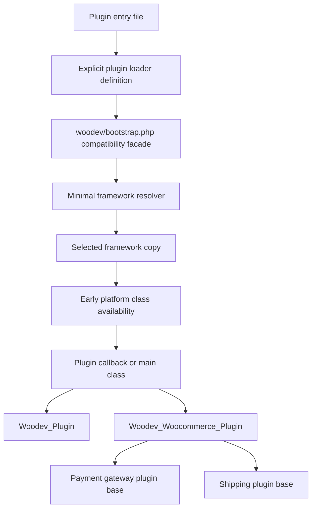

# Platform v2 Implementation Spec
> Status: ready for implementation planning
> Date: 2026-05-29
> Supersedes: stale implementation assumptions in `platform-v2-epic1-spec.md`

## 1. Purpose

This spec defines the Platform v2.0 implementation direction after the strategy reset, deep analysis, ADR-003, and ADR-004.

The goal is to implement a platform-first framework architecture where:

- `Woodev_Plugin` is a pure WordPress base class.
- `Woodev_Woocommerce_Plugin` owns WooCommerce runtime assumptions.
- Future platform classes, such as `Woodev_EDD_Plugin`, can be added without making WooCommerce a global framework dependency.
- `woodev/bootstrap.php` remains the installed compatibility entry path but delegates real early-loading logic to a minimal resolver.
- Production plugin internals may be rewritten for v2, but installed-site contracts are release-blocking compatibility requirements.

This document is the implementation source of truth for Platform v2. It supersedes the bridge-first parts of `platform-v2-epic1-spec.md` while preserving the useful dependency evidence and class-boundary goals from that earlier spec.

## 2. Inputs

- `PLANS.md` — strategic intent: pure WordPress base, WooCommerce subclass, future EDD support, plugin internals rewrite.
- `platform-v2-strategy-alignment.md` — hybrid roadmap, rewrite-first migration, installed-site contract policy.
- `platform-v2-next-analysis.md` — resolver, loader API, migration contract, and spec revision analysis.
- `adr/003-platform-v2-minimal-framework-resolver.md` — proposed minimal resolver boundary.
- `adr/004-platform-v2-plugin-loader-api.md` — proposed explicit plugin loader API.
- `platform-v2-epic1-spec.md` — previous platform-layer spec, now partially superseded.
- `platform-v2-dependency-matrix.md` — module ownership and WooCommerce dependency evidence.

## 3. Non-Goals

Platform v2.0 must stay focused on the platform split and resolver architecture.

Out of scope:

- No PHP code before this spec is complete and accepted as the next implementation source.
- No EDD runtime implementation in v2.0; reserve the platform concept only.
- No payment-gateway processing redesign or trait extraction.
- No shipping boilerplate, shipping UI, carrier abstraction, labels, tracking, or rate-pipeline redesign.
- No licensing webhooks or server-to-client push actions.
- No box-packer algorithm redesign or generic extraction.
- No React admin UI or frontend build tooling.
- No SkyVerge-style versioned namespace implementation in v2.0.

## 4. Supersession of Epic 1

`platform-v2-epic1-spec.md` remains useful historical evidence, but it must not be followed as the active implementation plan where it conflicts with this spec.

Keep from Epic 1:

- The platform-first class hierarchy goal: `Woodev_Plugin` → `Woodev_Woocommerce_Plugin` → specialized WooCommerce plugin bases.
- The dependency matrix references and module ownership evidence.
- Multi-version framework arbitration invariants.
- Pure WordPress plugins must not require WooCommerce.
- WooCommerce-only modules must stay isolated from pure WordPress plugin loading.
- Fixture expectations for pure WordPress, WooCommerce, payment, and shipping plugins.

Superseded from Epic 1:

- `bootstrap.php` as a broad platform-aware loader.
- Broad legacy `register_plugin()` bridge behavior as the central v2.0 invariant.
- Normalized `type = payment_gateway | shipping` metadata as runtime source of truth.
- The assumption that old plugin entry-file shape must survive as a primary architecture constraint.
- Production plugin migration as a late phase after framework bridge validation.
- Bridge removal planning as a main implementation phase.

New implementation invariant:

- Preserve installed-site behavior and data, not old framework-internal entry-file shape.

## 5. Target Architecture

Platform v2.0 uses a minimal early resolver plus platform-owned runtime classes.

Architecture rules:

- The resolver handles only early infrastructure that must happen before plugin callbacks run.
- Runtime behavior belongs to `Woodev_Plugin`, `Woodev_Woocommerce_Plugin`, specialized module bases, or platform services.
- Plugin loader metadata is allowed only when the resolver cannot safely derive the information before the plugin class is loaded.
- Inheritance or contracts are the runtime source of truth for plugin behavior.

## 6. Minimal Resolver

### 6.1 Entry Path

`woodev/bootstrap.php` remains the compatibility entry path for v2.0 because production plugins include framework copies from that path.

The file should become thin:

- Define or require the resolver facade.
- Keep `Woodev_Plugin_Bootstrap::instance()` available as the compatibility object for existing entry files.
- Delegate registration, arbitration, loading, requirement checks, notices, and callback invocation to the resolver.
- Avoid adding new platform behavior to `bootstrap.php` itself.

### 6.2 Resolver Responsibilities

The resolver owns:

- Accepting plugin registrations from explicit loaders and any temporary legacy adapter.
- Normalizing registrations into one internal definition shape.
- Validating definition fields and reporting malformed definitions clearly.
- Sorting candidate framework copies by framework version.
- Selecting the highest compatible framework copy.
- Loading classes from the selected framework path only.
- Checking PHP, WordPress, framework compatibility, and platform requirements.
- Checking WooCommerce active/version requirements only for WooCommerce registrations.
- Ensuring required platform and specialized base classes are available before plugin callbacks execute.
- Tracking incompatible registrations.
- Rendering admin notices and deactivation recovery links for skipped registrations.
- Invoking compatible plugin callbacks in the established `plugins_loaded` flow.
- Firing `woodev_plugins_loaded` after compatible plugin callbacks have run.

### 6.3 Resolver Non-Responsibilities

The resolver must not own:

- Payment gateway processing behavior.
- Shipping method behavior.
- Licensing activation, validation, updater decisions, or license UI behavior.
- Plugin install, upgrade, or data migrations.
- WooCommerce HPOS, Blocks, logger, template, REST status, or settings wrapper behavior after plugin instantiation.
- EDD runtime behavior.
- A broad module registry that can grow into a second framework kernel.

### 6.4 Boundary Tests

Resolver tests must fail if the resolver starts owning runtime platform behavior.

At minimum, tests should assert:

- Pure WordPress loading does not require WooCommerce functions, constants, or classes.
- WooCommerce requirements are checked only for WooCommerce registrations.
- Payment and shipping early class availability is handled without invoking payment/shipping runtime behavior.
- Licensing, migration, HPOS, Blocks, template, logger, and settings behavior are not executed by resolver-only tests.

## 7. Plugin Loader API

### 7.1 Loader Definition

Each production plugin should register an explicit loader definition. The implementation may choose an array, lightweight class, or value object under PHP 7.4 constraints, but the conceptual fields are fixed.

Required fields:

| Field | Required | Purpose |
|-------|----------|---------|
| `plugin_id` | Yes | Stable internal plugin ID; must match installed-site contracts where already shipped. |
| `plugin_name` | Yes | Human-readable name for notices and diagnostics. |
| `plugin_version` | Yes | Current plugin version for lifecycle and migration checks. |
| `framework_version` | Yes | Vendored framework version participating in resolver arbitration. |
| `plugin_file` | Yes | Main plugin file path for basename, paths, update identity, and deactivation links. |
| `platform` | Yes | Closed platform value: `wordpress`, `woocommerce`, reserved future `edd`. |
| `requirements` | Yes | PHP and WordPress minimums; platform-specific minimums when required. |
| `main_class` | Conditional | Main plugin class expected to satisfy platform contracts. |
| `callback` | Conditional | Initialization callback invoked after requirements and class availability pass. |

At least one of `main_class` or `callback` is required. Prefer both when the callback wraps singleton boot and `main_class` can be used for validation.

### 7.2 Platform Values

Allowed v2.0 platform values:

| Platform | Requirements | Runtime class expectation |
|----------|--------------|---------------------------|
| `wordpress` | PHP, WordPress | Extends `Woodev_Plugin` or implements a future base plugin contract. |
| `woocommerce` | PHP, WordPress, WooCommerce | Extends `Woodev_Woocommerce_Plugin` directly or through a specialized WooCommerce base. |
| `edd` | Reserved | Do not implement runtime behavior in v2.0. Definitions using this value should be rejected or marked unsupported unless a later spec opens the scope. |

### 7.3 Requirements Shape

The requirements definition must be explicit enough for resolver checks.

Required minimums:

- `php`
- `wordpress`

WooCommerce plugins additionally require:

- `woocommerce`

The implementation may adapt current keys such as `minimum_wp_version` and `minimum_wc_version` internally, but new explicit loader definitions should use one coherent `requirements` structure.

### 7.4 Early Capabilities

Loader metadata may request early class availability for specialized bases that must exist before a plugin callback or child class declaration can run.

Allowed v2.0 early capabilities:

- Base WordPress plugin class availability.
- WooCommerce platform plugin class availability.
- Payment gateway plugin base availability.
- Shipping plugin base availability.

Capability rules:

- Capabilities are early-loading hints, not runtime type truth.
- Capabilities must be from a closed set or validated class references.
- A payment capability must require `platform = woocommerce`.
- A shipping capability must require `platform = woocommerce`.
- After the main class is available, the resolver or a validation service should verify that the loaded class matches the declared platform and capability contracts where feasible.

Disallowed metadata pattern:

- Do not replace `is_payment_gateway` with a new loose `type = payment_gateway` runtime API.

## 8. Temporary Legacy Adapter

Rewrite-first migration means old developer-internal entry shape is not a long-term compatibility boundary. However, v2.0 still needs a controlled adapter if existing production plugins can load alongside migrated plugins before every entry file is rewritten.

Adapter rules:

- The adapter may translate current `register_plugin()` calls into the internal loader definition shape.
- The adapter exists only behind `Woodev_Plugin_Bootstrap::instance()` and must not become the preferred API.
- The adapter may preserve current fields needed for live plugin coexistence, including framework version, plugin path, callback, `backwards_compatible`, `minimum_wp_version`, `minimum_wc_version`, `is_payment_gateway`, and `load_shipping_method`.
- Legacy `is_payment_gateway` and `load_shipping_method` may map only to early class availability capabilities.
- The adapter must not make legacy flags the runtime source of truth.
- The adapter removal date should be decided only after all production plugin migration contracts are complete and at least one migrated production plugin has shipped safely.

## 9. Platform Class Boundaries

### 9.1 `Woodev_Plugin`

`Woodev_Plugin` owns platform-neutral WordPress plugin infrastructure.

Target owner responsibilities:

- Plugin identity, version, file, paths, URLs, and text domain.
- Translation loading.
- Generic dependency checks for PHP functions, PHP extensions, PHP settings, and WordPress minimums.
- Generic admin notices and admin messages when not WooCommerce-specific.
- Hook deprecation infrastructure.
- Lifecycle foundation for install, upgrade, activation, deactivation, and migration events after WooCommerce helper usage is removed or adapted.
- Plugin updater infrastructure.
- Licensing core that communicates with the WooDev/EDD store without depending on WooCommerce runtime.
- Platform-neutral API base classes.
- Platform-neutral settings primitives after WooCommerce helper calls are removed or guarded.
- Generic script handling.
- Generic utilities such as async requests and background jobs after WooCommerce debug/session hooks are guarded or moved.

`Woodev_Plugin` must not require WooCommerce to be active, loaded, or installed.

### 9.2 `Woodev_Woocommerce_Plugin`

`Woodev_Woocommerce_Plugin` owns WooCommerce runtime assumptions.

Target owner responsibilities:

- WooCommerce active/version requirement enforcement after resolver gates pass.
- WooCommerce compatibility helpers.
- HPOS/order compatibility.
- Cart/Checkout Blocks compatibility declarations.
- WooCommerce feature compatibility declarations.
- WooCommerce logger helpers.
- WooCommerce template loading helpers.
- WooCommerce settings wrappers and settings-page hook integration.
- WooCommerce system-status rows.
- WooCommerce REST status/settings behavior.
- WooCommerce admin capability defaults where they are not appropriate for pure WordPress plugins.

### 9.3 Specialized WooCommerce Modules

These remain WooCommerce-only in v2.0:

- `payment-gateway/`
- `shipping-method/`
- `box-packer/`
- `compatibility/class-order-compatibility.php`
- `compatibility/class-plugin-compatibility.php`
- `handlers/blocks-handler.php`

Target inheritance:

- `Woodev_Payment_Gateway_Plugin` extends `Woodev_Woocommerce_Plugin`.
- `Woodev\Framework\Shipping\Shipping_Plugin` extends `\Woodev_Woocommerce_Plugin`.

No payment, shipping, or box-packer runtime behavior should be redesigned as part of the platform split.

## 10. Early Class Availability

The resolver must make required base classes available before a plugin callback can declare or instantiate child plugin classes.

Required guarantees:

- The selected framework copy supplies all classes loaded for a registration.
- Pure WordPress plugin callbacks can run when WooCommerce is absent.
- WooCommerce plugin callbacks are skipped when WooCommerce is absent or below the declared minimum.
- `Woodev_Plugin` is available before a pure WordPress plugin callback runs.
- `Woodev_Woocommerce_Plugin` is available before a WooCommerce plugin callback runs.
- `Woodev_Payment_Gateway_Plugin` is available before a payment plugin callback can declare or instantiate a payment child class.
- `Woodev\Framework\Shipping\Shipping_Plugin` is available before a shipping plugin callback can declare or instantiate a shipping child class.
- WooCommerce-only classes are not required for pure WordPress plugin registrations.

Validation rules:

- If `main_class` is declared, validate it against the platform boundary after class availability is established.
- If a payment capability is declared, the final main class should extend the payment base or implement a future payment plugin contract where feasible.
- If a shipping capability is declared, the final main class should extend the shipping base or implement a future shipping plugin contract where feasible.
- Invalid combinations should produce clear developer/admin diagnostics and must not fatal the site where graceful skipping is possible.

## 11. Migration Contract Gates

Rewrite-first applies to plugin internals only. Installed-site contracts must be audited before any production plugin rewrite PR is approved.

### 11.1 Required Migration Contract Document

Each production plugin migration must create a contract document before PHP changes begin in that plugin.

The document must include:

- Stable plugin ID and slug.
- Plugin basename and update identity.
- Current production version and target migration version.
- Option keys and settings arrays.
- License key option names, license activation state, instance IDs, and updater state.
- WooCommerce payment gateway IDs, when applicable.
- WooCommerce shipping method IDs and instance setting keys, when applicable.
- Public action and filter names.
- Deprecated hook wrappers still used by sites.
- Scheduled cron hooks, recurrence, payload shape, and queue state.
- Custom database tables or stored schemas.
- REST route namespaces and route names.
- AJAX action names.
- Admin page slugs and capability checks.
- Log source names.
- Background job identifiers.
- Email IDs, note sources, and system-status rows.

### 11.2 Migration Routine Rules

Migration routines must be:

- Idempotent.
- Non-destructive by default.
- Explicit about old-to-new option key maps.
- Explicit about failure behavior: stop, retry, mark partial, or show admin notice.
- Logged through lifecycle events or migration diagnostics.
- Covered by upgrade tests from the latest production version.
- Covered by at least one older supported production-version upgrade path when feasible.

### 11.3 Release-Blocking Gates

A production plugin migration cannot ship until these checks pass:

- Fresh install works.
- Upgrade from latest production works.
- Upgrade from at least one older supported production version works when feasible.
- License remains active after migration.
- Updater identity remains continuous.
- Existing settings remain unchanged unless an explicit migration says otherwise.
- Payment or shipping method IDs remain stable where user configuration depends on them.
- Public hooks still fire or deprecated wrappers exist.
- Scheduled events remain correct after activation, deactivation, and upgrade.
- Stored data schemas are preserved or migrated idempotently.

## 12. Fixture and Test Matrix

### 12.1 Fixtures

Minimum fixture set:

| Fixture | Purpose | Required assertions |
|---------|---------|---------------------|
| Pure WordPress plugin | Proves platform-neutral loading. | Loads without WooCommerce; extends `Woodev_Plugin`; no WC constants/functions/classes required. |
| WooCommerce plugin | Proves platform-gated loading. | Skipped when WooCommerce is unavailable; loads when version requirement passes; extends `Woodev_Woocommerce_Plugin`. |
| Payment gateway plugin | Proves specialized early class availability. | Payment base exists before callback; platform is WooCommerce; runtime payment internals are not redesigned. |
| Shipping plugin | Proves namespaced specialized early class availability. | Shipping base exists before callback; platform is WooCommerce; runtime shipping internals are not redesigned. |
| Multi-framework fixture pair | Proves vendored arbitration. | Highest compatible framework wins; incompatible registration is skipped with notice data. |
| Invalid loader fixture | Proves validation behavior. | Missing fields, bad platform, bad callback, or mismatched capability produces clear diagnostics without broad fatal behavior. |
| Migration fixture | Proves installed-site contract discipline. | Option, license, method ID, hook, and scheduled-event contract checks can be represented in tests. |

### 12.2 Test Categories

Required tests:

- Resolver normalization and validation.
- Framework version/path arbitration.
- Highest-compatible-version selection.
- Backward-compatibility window handling.
- PHP and WordPress requirement failures.
- WooCommerce requirement checks only for WooCommerce registrations.
- Pure WordPress loading with WooCommerce absent.
- WooCommerce registration skipping when WooCommerce is absent.
- Early class availability for base, WooCommerce, payment, and shipping classes.
- Callback timing and `woodev_plugins_loaded` timing.
- Incompatible registration admin notice data.
- Temporary legacy adapter mapping, if retained.
- Loader metadata validation against platform and capability contracts.
- Migration contract smoke checks for fixture data.

### 12.3 Verification Gate

Framework implementation PRs must pass:

- `composer phpcs`
- `composer phpstan`
- `composer test`
- `composer check`

Production plugin migration PRs must additionally pass their plugin-specific migration contract checklist and upgrade tests.

## 13. Implementation Phases

Phase 0: Spec acceptance and branch reset

- Treat this document as the active implementation source.
- Do not continue the old `feat/platform-v2-epic1-spike` branch directly without applying the keep/discard list in section 14.
- Confirm ADR-003 and ADR-004 status or keep them as proposed but referenced by this spec.

Phase 1: Resolver facade extraction

- Keep `woodev/bootstrap.php` as compatibility entry path.
- Introduce minimal resolver boundary behind the facade.
- Add resolver tests for registration normalization, version arbitration, requirement checks, and notices.
- Do not move runtime platform behavior into the resolver.

Phase 2: Explicit loader definition

- Implement the loader definition shape and validation.
- Add fixtures for pure WordPress, WooCommerce, payment, shipping, invalid loader, and multi-framework cases.
- Add temporary legacy adapter only to the minimum extent required for coexistence with unmigrated production plugins.

Phase 3: Platform class split

- Introduce or finalize `Woodev_Woocommerce_Plugin`.
- Move WooCommerce runtime assumptions from `Woodev_Plugin` into `Woodev_Woocommerce_Plugin`.
- Preserve public wrappers only when needed for installed-site compatibility or live production migrations.

Phase 4: Early class availability and specialized bases

- Make selected framework classes available consistently before callbacks.
- Update payment and shipping bases to depend on `Woodev_Woocommerce_Plugin`.
- Test payment/shipping child class declaration timing.

Phase 5: Platform-neutral module cleanup

- Remove or guard residual WooCommerce helper usage in base-owned modules.
- Prioritize lifecycle, API, settings, licensing, plugin updater, and utilities according to the dependency matrix.

Phase 6: Production plugin migration contracts

- Create migration contract docs before rewriting each production plugin.
- Migrate plugin loaders and class inheritance only after contract gates are defined.
- Do not release a migrated plugin until installed-site contract tests pass.

Phase 7: Future cleanup decisions

- Decide adapter removal only after production migrations prove safe.
- Revisit versioned namespace strategy in v2.x/v3 after platform boundaries stabilize.

## 14. Spike Keep/Discard List

The `feat/platform-v2-epic1-spike` branch is evidence, not the implementation path to continue blindly.

Keep as evidence:

- The class hierarchy split is feasible.
- Early metadata can make base classes available before callback execution.
- Fixtures can model pure WordPress, WooCommerce, payment, and shipping registrations.
- Pure WordPress no-WooCommerce loading is a valid acceptance test.
- Multi-version resolver invariants remain required.

Keep only if redesigned to match this spec:

- Any `Woodev_Plugin_Bootstrap` changes that can become a thin facade over a minimal resolver.
- Any registration normalization that can be narrowed to explicit loader definitions and early capabilities.
- Any fixture changes that prove resolver/class-availability behavior without blessing loose runtime type strings.

Discard or redesign:

- Bootstrap growing into a broad platform-aware loader.
- Generalized string metadata as runtime plugin type source.
- Broad compatibility bridge code that preserves old developer-internal entry shape without a production migration need.
- Phase ordering that delays migration contracts until after framework bridge validation.
- Any scope creep into payment internals, shipping internals, licensing webhooks, box-packer redesign, EDD runtime, React UI, or versioned namespaces.

## 15. Risks and Mitigations

| Risk | Mitigation |
|------|------------|
| Resolver becomes a hidden kernel. | Keep section 6 boundary tests and reject runtime platform behavior in resolver PRs. |
| Loader metadata recreates `is_payment_gateway`. | Use metadata only for early infrastructure; validate behavior through inheritance/contracts. |
| Pure WordPress support is declared too early. | Require no-WooCommerce fixture tests and cleanup of residual WC helper usage before marking complete. |
| Production rewrites break installed sites. | Require migration contract documents and release-blocking gates before plugin rewrites. |
| Early class availability causes fatals. | Test callback timing for base, WooCommerce, payment, and shipping fixture classes. |
| Multi-plugin framework arbitration regresses. | Preserve highest-compatible-version tests with multiple vendored framework fixture registrations. |
| EDD scope leaks into v2.0. | Reserve metadata only; reject runtime implementation until a future spec opens the scope. |
| Spike code biases implementation toward stale Epic 1 assumptions. | Apply section 14 before reusing any spike changes. |

## 16. Definition of Done

Platform v2 framework implementation is not done until:

- The resolver facade is implemented behind `woodev/bootstrap.php`.
- Explicit loader definitions are validated.
- Pure WordPress plugins load without WooCommerce.
- WooCommerce plugins are gated by WooCommerce requirements.
- Payment and shipping base classes are available before callbacks that need them.
- Runtime WooCommerce behavior lives outside the resolver.
- `Woodev_Plugin` no longer requires WooCommerce runtime for base plugin loading.
- Fixture matrix tests cover pure WordPress, WooCommerce, payment, shipping, invalid loader, and multi-framework arbitration.
- `composer check` passes.
- At least one production plugin migration contract is written before that plugin rewrite begins.

## Related

- [PLANS.md](../PLANS.md) — strategic source for platform-first refactoring.
- [Platform v2 Strategy Alignment](platform-v2-strategy-alignment.md) — hybrid roadmap and rewrite-first migration policy.
- [Platform v2 Next Analysis](platform-v2-next-analysis.md) — resolver, loader API, and migration analysis.
- [ADR-003](adr/003-platform-v2-minimal-framework-resolver.md) — minimal resolver decision.
- [ADR-004](adr/004-platform-v2-plugin-loader-api.md) — explicit loader API decision.
- [Platform v2 Epic 1 Spec](platform-v2-epic1-spec.md) — previous spec with stale bridge-first implementation assumptions.
- [Platform v2 Dependency Matrix](platform-v2-dependency-matrix.md) — module dependency and ownership evidence.
