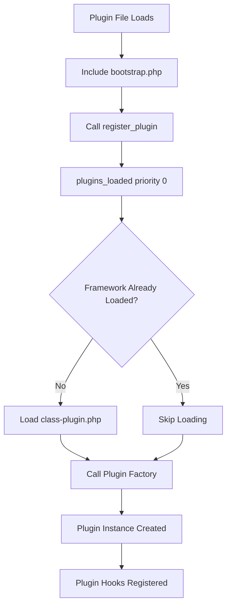

# Getting Started with Woodev Framework

This guide covers everything you need to start building WooCommerce plugins with the Woodev Framework.

## Requirements

### Server Requirements

| Requirement | Minimum | Recommended |
| --- | --- | --- |
| PHP | 7.4 | 8.1+ |
| WordPress | 5.9 | 6.4+ |
| WooCommerce | 5.6 | 8.0+ |
| MySQL | 5.6 | 8.0+ |
| PHP Extensions | curl, json | mbstring, xml |

### Required PHP Extensions

The framework can check for required extensions automatically:

```php
parent::__construct(
    'my-plugin',
    '1.0.0',
    [
        'dependencies' => [
            'php_extensions' => [ 'curl', 'json', 'mbstring' ],
        ],
    ]
);
```

### Required PHP Functions

```php
parent::__construct(
    'my-plugin',
    '1.0.0',
    [
        'dependencies' => [
            'php_functions' => [ 'gzinflate', 'base64_decode' ],
        ],
    ]
);
```

### Required PHP Settings

```php
parent::__construct(
    'my-plugin',
    '1.0.0',
    [
        'dependencies' => [
            'php_settings' => [
                'allow_url_fopen' => '1',
                'max_execution_time' => '30',
            ],
        ],
    ]
);
```

## Installation

### Step 1: Include the Framework

Copy the `woodev/` directory into your plugin:

```text
my-plugin/
├── my-plugin.php
├── includes/
│   └── class-my-plugin.php
└── woodev/
    ├── bootstrap.php
    ├── class-plugin.php
    └── ...
```

### Step 2: Register Your Plugin

In your main plugin file (`my-plugin.php`):

```php
<?php
/**
 * Plugin Name: My Plugin
 * Plugin URI: https://example.com/my-plugin
 * Description: My WooCommerce plugin
 * Version: 1.0.0
 * Author: Your Name
 * Text Domain: my-plugin
 * Domain Path: /languages
 * Requires at least: 5.9
 * Requires PHP: 7.4
 * WC requires at least: 5.6
 * License: GPL-3.0+
 * License URI: http://www.gnu.org/licenses/gpl-3.0.txt
 */

defined( 'ABSPATH' ) || exit;

// Include the bootstrap file
if ( ! class_exists( 'Woodev_Plugin_Bootstrap' ) ) {
    require_once plugin_dir_path( __FILE__ ) . 'woodev/bootstrap.php';
}

// Initialize the plugin
add_action( 'plugins_loaded', 'init_my_plugin', 0 );

function init_my_plugin() {
    Woodev_Plugin_Bootstrap::instance()->register_plugin(
        '1.4.0',  // Framework version bundled
        'My Plugin',
        __FILE__,
        'my_plugin_init',
        [
            'minimum_wc_version'   => '8.0',
            'minimum_wp_version'   => '5.9',
            'backwards_compatible' => '1.4.0',
        ]
    );
}
```

### Step 3: Create Plugin Class

Create `includes/class-my-plugin.php`:

```php
<?php
/**
 * Main Plugin Class
 *
 * @package MyPlugin
 */

defined( 'ABSPATH' ) || exit;

/**
 * Main Plugin Class
 */
final class My_Plugin extends Woodev_Plugin {

    /**
     * @var self|null
     */
    private static $instance;

    /**
     * Get plugin instance
     *
     * @return self
     */
    public static function instance(): self {
        if ( null === self::$instance ) {
            self::$instance = new self();
        }
        return self::$instance;
    }

    /**
     * Constructs the class
     */
    public function __construct() {
        parent::__construct(
            'my-plugin',
            '1.0.0',
            [
                'text_domain' => 'my-plugin',
                'supported_features' => [
                    'hpos'   => true,
                    'blocks' => [
                        'cart'     => true,
                        'checkout' => true,
                    ],
                ],
            ]
        );
    }

    /**
     * Get the main plugin file
     *
     * @return string
     */
    public function get_file(): string {
        return __FILE__;
    }

    /**
     * Get the plugin name
     *
     * @return string
     */
    public function get_plugin_name(): string {
        return __( 'My Plugin', 'my-plugin' );
    }

    /**
     * Get the download ID for licensing
     * Return 0 if no licensing
     *
     * @return int
     */
    public function get_download_id(): int {
        return 0;
    }
}
```

### Step 4: Initialize the Plugin

Back in `my-plugin.php`:

```php
function my_plugin_init() {
    require_once plugin_dir_path( __FILE__ ) . 'includes/class-my-plugin.php';
    return My_Plugin::instance();
}
```

## Architecture Overview

### Framework Bootstrap Flow



### Plugin Lifecycle

```text
1. Registration (register_plugin)
         ↓
2. Bootstrap (plugins_loaded)
         ↓
3. Dependencies Check
         ↓
4. Plugin Construction
         ↓
5. init hook
         ↓
6. admin_init (if admin)
         ↓
7. before_woocommerce_init
         ↓
8. woocommerce_init
```

### Directory Structure

Recommended plugin structure:

```text
my-plugin/
├── my-plugin.php              # Main plugin file
├── includes/
│   ├── class-my-plugin.php    # Main plugin class
│   ├── class-settings.php     # Settings handler
│   ├── class-api.php          # API client
│   └── class-admin.php        # Admin handler
├── admin/
│   ├── class-admin-page.php   # Admin page class
│   └── views/
│       └── settings.php       # Settings view
├── assets/
│   ├── css/
│   │   └── admin.css
│   └── js/
│       └── admin.js
├── languages/
│   └── my-plugin.pot
├── templates/
│   └── email-template.php
└── woodev/                    # Framework directory
    ├── bootstrap.php
    ├── class-plugin.php
    └── ...
```

## Plugin Registration Arguments

### Complete Example

```php
Woodev_Plugin_Bootstrap::instance()->register_plugin(
    '1.4.0',  // Framework version
    'My Plugin',
    __FILE__,
    'my_plugin_init',
    [
        // Version requirements
        'minimum_wc_version'   => '8.0',
        'minimum_wp_version'   => '5.9',
        'backwards_compatible' => '1.4.0',
        
        // Plugin type flags
        'load_shipping_method' => false,
        'is_payment_gateway'   => false,
        
        // Text domain
        'text_domain'          => 'my-plugin',
    ]
);
```

### Arguments Reference

| Argument | Type | Default | Description |
| --- | --- | --- | --- |
| `minimum_wc_version` | `string` | `''` | Minimum WooCommerce version |
| `minimum_wp_version` | `string` | `''` | Minimum WordPress version |
| `backwards_compatible` | `string` | `''` | Minimum framework version for compatibility |
| `load_shipping_method` | `bool` | `false` | Load shipping method base classes |
| `is_payment_gateway` | `bool` | `false` | Load payment gateway base classes |

## Plugin Constructor Arguments

### Complete Example

```php
parent::__construct(
    'my-plugin',  // Plugin ID
    '1.0.0',      // Plugin version
    [
        'text_domain' => 'my-plugin',
        
        // PHP dependencies
        'dependencies' => [
            'php_extensions' => [ 'curl', 'json' ],
            'php_functions'  => [ 'mb_strtolower' ],
            'php_settings'   => [ 'allow_url_fopen' ],
        ],
        
        // Feature support
        'supported_features' => [
            'hpos'   => true,
            'blocks' => [
                'cart'     => true,
                'checkout' => true,
            ],
        ],
    ]
);
```

### Arguments Reference

| Argument | Type | Description |
| --- | --- | --- |
| `$id` | `string` | Unique plugin identifier |
| `$version` | `string` | Plugin version |
| `$args['text_domain']` | `string` | Text domain for translations |
| `$args['dependencies']` | `array` | PHP dependencies |
| `$args['supported_features']` | `array` | Feature flags |

## Required Methods

Every plugin must implement these three methods:

```php
class My_Plugin extends Woodev_Plugin {

    public function get_file(): string {
        return __FILE__;
    }

    public function get_plugin_name(): string {
        return __( 'My Plugin', 'my-plugin' );
    }

    public function get_download_id(): int {
        return 0;  // EDD download ID or 0
    }
}
```

## Optional Methods

Override these methods to customize plugin behavior:

```php
class My_Plugin extends Woodev_Plugin {

    // Custom settings handler
    public function get_settings_handler(): ?Woodev_Abstract_Settings {
        return new My_Settings( $this );
    }

    // Custom lifecycle handler
    public function get_lifecycle_handler(): Woodev_Lifecycle {
        return new My_Lifecycle( $this );
    }

    // Custom setup wizard
    public function get_setup_wizard_handler(): ?Woodev_Plugin_Setup_Wizard {
        return new My_Setup_Wizard( $this );
    }

    // Custom blocks handler
    public function get_blocks_handler(): Woodev_Blocks_Handler {
        return new My_Blocks_Handler( $this );
    }

    // Custom REST API handler
    public function init_rest_api_handler() {
        $this->rest_api_handler = new My_REST_API( $this );
    }
}
```

## Common Tasks

### Adding Admin Menu

```php
class My_Plugin extends Woodev_Plugin {

    public function init_admin() {
        parent::init_admin();
        
        add_action( 'admin_menu', [ $this, 'add_admin_menu' ] );
    }

    public function add_admin_menu() {
        add_submenu_page(
            'woocommerce',
            __( 'My Plugin', 'my-plugin' ),
            __( 'My Plugin', 'my-plugin' ),
            'manage_woocommerce',
            'my-plugin',
            [ $this, 'render_settings_page' ]
        );
    }

    public function render_settings_page() {
        echo '<h1>' . esc_html( $this->get_plugin_name() ) . '</h1>';
        // Settings form here
    }
}
```

### Adding Settings

```php
class My_Settings extends Woodev_Abstract_Settings {

    protected function register_settings() {
        $this->register_setting(
            'api_key',
            'string',
            [
                'name'        => __( 'API Key', 'my-plugin' ),
                'description' => __( 'Your API key', 'my-plugin' ),
                'default'     => '',
            ]
        );
    }
}
```

### Adding Background Jobs

```php
class My_Job_Handler extends Woodev_Background_Job_Handler {

    protected $prefix = 'my_plugin';
    protected $action = 'process';

    protected function process_item( $item, $job ) {
        // Process item
        return null;
    }
}

// Usage
$handler = new My_Job_Handler();
$job = $handler->create_job( [
    'data' => [ [ 'id' => 1 ], [ 'id' => 2 ] ],
] );
$handler->dispatch();
```

## Debugging

### Enable Debug Mode

```php
// In wp-config.php
define( 'WP_DEBUG', true );
define( 'WP_DEBUG_LOG', true );
define( 'WP_DEBUG_DISPLAY', false );
```

### Logging

```php
// Log message
$plugin->log( 'Processing order #' . $order_id );

// Log error
$plugin->log( 'Error: ' . $error_message );

// View logs: WooCommerce > Status > Logs
```

### System Status

Your plugin automatically adds data to:
`WooCommerce > Status > [Your Plugin]`

## Best Practices

### 1. Use Singleton Pattern

```php
final class My_Plugin extends Woodev_Plugin {

    private static $instance;

    public static function instance(): self {
        if ( null === self::$instance ) {
            self::$instance = new self();
        }
        return self::$instance;
    }
}
```

### 2. Mark Class as Final

```php
// Prevent inheritance
final class My_Plugin extends Woodev_Plugin {}
```

### 3. Use Text Domain

```php
// Always use text domain for translations
__( 'String to translate', 'my-plugin' );
```

### 4. Escape Output

```php
// Escape output
echo esc_html( $value );
echo esc_url( $url );
echo esc_attr( $attribute );
```

### 5. Sanitize Input

```php
// Sanitize input
$value = sanitize_text_field( $_POST['value'] ?? '' );
$id = absint( $_GET['id'] ?? 0 );
```

## Next Steps

After completing setup:

1. **[Core Framework](core-framework.md)** — Learn about the plugin base class
2. **[Settings API](settings-api.md)** — Add plugin settings
3. **[Admin Module](admin-module.md)** — Create admin pages
4. **[Utilities](utilities.md)** — Implement background processing

## Troubleshooting

### Plugin Not Loading

1. Check that `bootstrap.php` is included correctly
2. Verify `register_plugin()` is called on `plugins_loaded`
3. Check PHP error logs for fatal errors

### Dependencies Not Met

The framework displays admin notices for missing dependencies. Check:

- PHP extensions in `phpinfo()`
- PHP functions availability
- PHP settings in `php.ini`

### Version Conflicts

If multiple plugins bundle different framework versions:

- The highest version is always loaded
- Lower version plugins still initialize
- Check `backwards_compatible` argument

---

*For more information, see [README.md](README.md) and [Core Framework](core-framework.md).*
